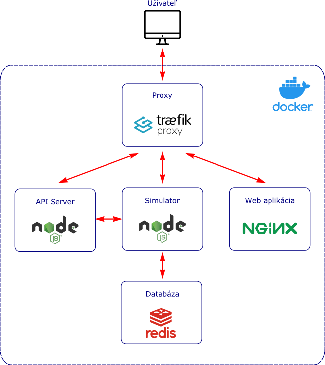
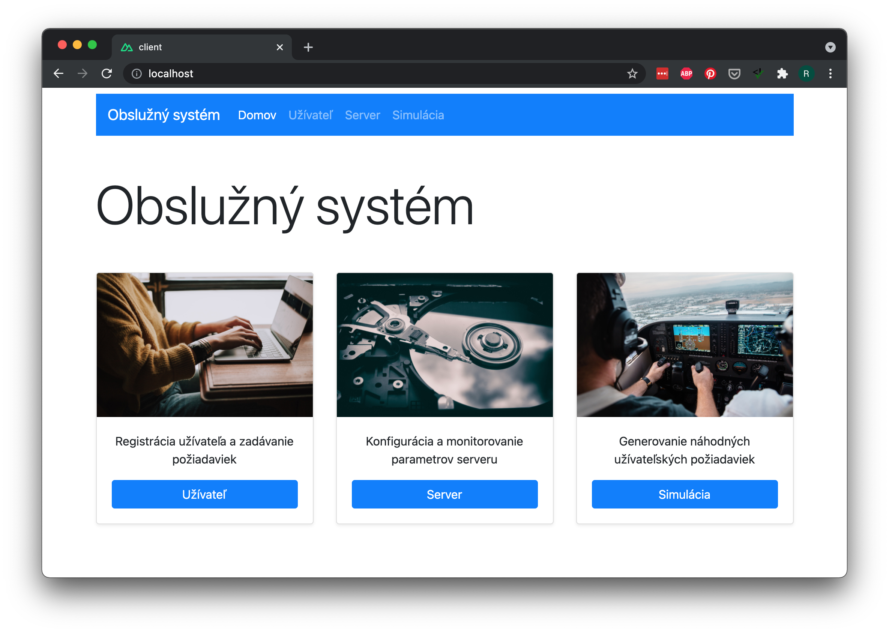

# Obslužný systém

Tento repozitár implementuje zadanie vzorového projektu obslužného systému bežiaceho v Node.js.

**Obsah**:

- [Obslužný systém](#obslužný-systém)
  - [Rýchly štart](#rýchly-štart)
  - [Popis riešenia](#popis-riešenia)
    - [Proxy server](#proxy-server)
    - [API server](#api-server)
    - [Simulačný server](#simulačný-server)
    - [Webová aplikácia](#webová-aplikácia)
  - [Obmedzenia](#obmedzenia)
  - [Štruktúra projektu](#štruktúra-projektu)
  - [Konfigurácia](#konfigurácia)

**Odkazy**:

- [Zadanie](doc/zadanie/Zadanie%20NodeJS.pdf)
- [Dokumentácia REST API](https://obsluznysystem.docs.apiary.io/)

## Rýchly štart

Obslužný systém beží v [docker](https://www.docker.com/) kontaineroch.
Obslužný systém sa ovláda webovou stránkou ktorá je súčasťou projektu.

Postup pre spustenie:

1. Naklonovanie projektu

```
git clone https://github.com/rastislavskultety/obsluzny-system.git
```

2. Spustenie docker kontainerov

```
cd obsluzny-system
docker-compose up
```

3. Otvorenie stránky v prehliadači

```
open http://localhost
```


## Popis riešenia

Obslužný systém pozostáva zo štyroch častí, pričom každá beží v oddelenom docker kontaineri.

- Proxy server
- Api server
- Server pre simuláciu užívateľských požiadavie
- Webová aplikácia



### Proxy server

Proxy server [Traefic](https://doc.traefik.io/traefik/) je použitý na smerovanie http komunikácie
z klienskej aplikácie k trom ďalším kontainerom (api serveru, simulačnému serveru a k statickým stránkam).

### API server

Je spustený v docker kontaineri `server`. Tento server implementuje logiku obslužného systému a vystavuje ju v REST API rozhraní.

Odkaz na dokumentáciu použitého api: [REST API Dokumentácia](https://obsluznysystem.docs.apiary.io/).

Server je implementovaný v Node.js v16 a využíva framework Express.js v4 pre obsluhu http požiadaviek.
Zdrojový kód využíva [Typescript](https://www.typescriptlang.org/).

Server je možné konfigurovať pomocou konfiguračného súboru `config/config.docker.jsonc` ale tiež dynamicky
za behu pomocou webovej aplikácie.

### Simulačný server

Simuluje posielanie užívateľských požiadaviek na api server.

Je implementovaný v [Node.js](https://nodejs.org/) v16. Simulačný server sa ovláda webovou aplikáciou s ktorou
komunikuje cez websocket kanál.

### Webová aplikácia

Webová aplikácia obsahuje rozhranie pre užívateľa, konfiguráciu serveru, monitorovanie serveru a simuláciu užívateľských požiadaviek. Má formu single page application.

Celá aplikácia je vytvorená pomocou frameworkov [Nuxt.js](https://nuxtjs.org/) + [Vue.js](https://vuejs.org/) + [BoostrapVue](https://bootstrap-vue.org/). Kód aplikácie využíva [Typescript](https://www.typescriptlang.org/).

Framework Nuxt.js je nastavený tak že vygeneruje aplikáciu vo formé statických html stránok. Tieto sú potom
poskytované pomocou proxy servera [Nginx](https://www.nginx.com/) bežiacom v docker kontaineri `web`.



## Obmedzenia

API server je spravený kvôli jednoduchosti ako jednoprocesová aplikácia a nie je pripravený na to aby bežaal distribuovane. Napriek tomu je zdrojový kód servera napísaný tak, že všetky relevantné funkcie sú spravené
asynchrónne, čo umožní jednoduchú implementáciu servera bežiaceho vo viacerých inštanciách.

## Štruktúra projektu

Projekt má túto štruktúru adresárov:

```
+ client - Webová aplikácia
  + components - stavebné komponenty aplikácie
  + pages - hlavná stránka
  + ...
+ server - API server
  + src - zdrojový kód
    + api - REST api metódy
    + config - konfiguračné súbory servera
    + data - databáza (JSON súbor)
    + middleware - middleware funkcie pre spracovanie http požiadaviek
    + services - aplikačná logika
  + tests - unit testy
  + ...
+ simulator - Simulačný server
  + src - zdrojový kód
    + config - konfiguračné súbory servera
  + ...
+ traefik - Konfigurácia pre proxy
+ www - statické stránky webovej aplikácie (kópia z client/dist)
```

## Konfigurácia

Api server je možné konfigurovať v súbore `server/src/config/config.docker.jsonc`, ktorý obsahuje
samovysvetľujúce komentáre:

```jsonc
{
  /* Počiatočná konfigurácia obslužného systému */
  "service": {
    "numberOfQueues": 3, // parameter n, celé číslo > 0
    "queueCapacity": 5, // parameter m, celé číslo > 0
    "meanServiceTime": 1.0, // parameter t, v sekundách, > 0
    "serviceTimeDeviation": 0.5 // parameter r, v sekundách, musí byť >= 0 a zároveň < meanServiceTime
  },
  "server": {
    "logging": false, // logovanie http požiadaviek na konzolu
    "security": {
      "cookieSecret": "qe12}$NOq12Jkl" // pre vytváranie signed cookies
    }
  }
}
```

Pretože je možné parametre zadania meniť aj dynamicky pomocou web aplikácie,
nie je nutné meniť prednastavenú konfiguráciu.


